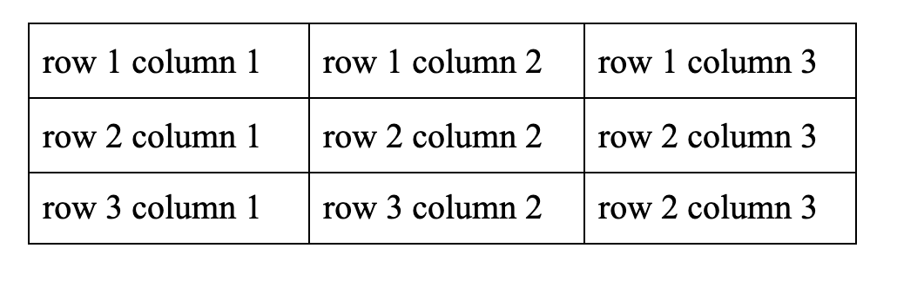
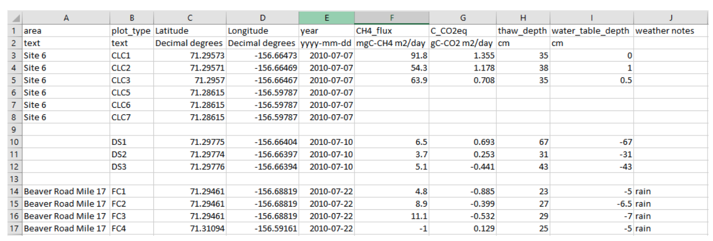
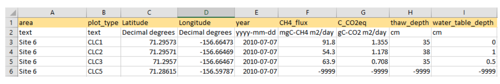
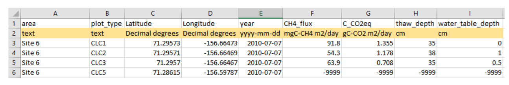
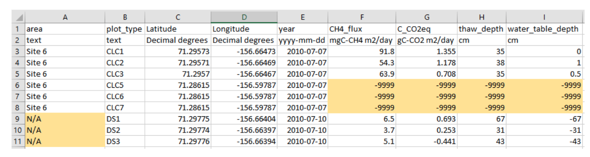

# Detailed Guide to the CSV Reporting Format Elements

## Contents of the Elements 

[File Structure](#file-structure)  
- [Character Set](#character-set)  
- [Delimiter](#delimiter)  
- [Column Header Row](#column-header-row)  
- [Data Matrix](#data-matrix)  

[Naming Structure](#naming-structure)  
- [File Name](#file-name)  
- [Column Headers](#column-headers)  
- [Units](#units)  

[Field Structure](#field-structure)  
- [Consistent Values](#consistent-values)  
- [Missing Value Codes](#missing-value-codes)  
- [Temporal Data](#temporal-data)  
- [Spatial Data](#spatial-data)  

---

## File Structure

#### **Character Set**

Use the standard US-ASCII character set without extensions.

This requirement will increase machine readability and interoperability. Most data providers will not need to do anything to meet this standard.

Use the standard US-ASCII character set without extensions as the extended characters can disrupt the rendering and interpretation of data in some programs. Data stored using the comma separated values format (CSV) (RFC 4180) must use the standard seven-bit American Standard Code for Information Interchange (US-ASCII) characters (RFC 20) (Table 1).

Typically, programs used to create the data will use the UTF-8 character-encoding scheme by default, which includes all the US-ASCII characters. However, the standard presented here requires that no extended characters be used beyond the 127 characters defined in the US-ASCII character set.

The US-ASCII characters include all upper- and lowercase characters, digits, and common punctuation used in the English language. Most English-language dataset submissions will require only characters included in the standard ASCII character set.

--- 

#### **Delimiter**

Use a comma as the delimiter, and avoid commas except as a delimiter.

Save tabular data in comma separated values (CSV) format. The delimiter between columns must be the comma character "," (ASCII Code 44). This puts the "C" in the "CSV" file format, and is common for "flat-file" encoding. 

Example of cell entries separated by commas as viewed in Notepad++

Cell entries cannot contain a comma (exception listed below). This requirement is necessary for machine readability, as unprotected commas will disrupt the interpretation of columns and rows. Commas in a CSV file are the delimiters and commas in the cell entries should be either replaced or enclosed:  
- Use a vertical bar "|" instead of a comma  
&nbsp;&nbsp;-Example  
&nbsp;&nbsp;&nbsp;&nbsp;Doe|Jane  
&nbsp;&nbsp;&nbsp;&nbsp;Standing water|ponded
&nbsp;&nbsp;&nbsp;&nbsp;Area A|Area B|Area C
-Use enclosing quotes around the cell entries containing commas.  
&nbsp;&nbsp;-Example   
&nbsp;&nbsp;&nbsp;&nbsp;"Doe, Jane"  
&nbsp;&nbsp;&nbsp;&nbsp;"Standing water, ponded"  
&nbsp;&nbsp;&nbsp;&nbsp;“Area A, Area B, Area C”

If data providers enter their data into programs like Microsoft Excel or Libre Office commas that appear in cells will be detected and protected by quotation marks automatically. Data that are output from models or written in a simple text editor might need quotation marks added to text cells manually.

--- 

#### **Data Matrix** 

The contents of the data portion of the file must be organized in a logical and readable matrix format. There can be no empty rows and there must be the same number of columns across all of its rows.  

Well formatted 

Not well formatted

--- 

#### **Column Header Row**

The Data Matrix portion of each file should contain a column header row.

Example of a column header row (highlighted) visualized in Excel.

--- 

## Naming Structure

#### **File Name**

Provide unique file names that are as descriptive as possible about the file contents. Use only letters (i.e. CamelCase), numbers, and underscores "_". Do not include spaces. Hyphens allowed but not preferred.

Example:  
- burned_plot_veg_2016.csv  
- SoilPoreWaterHillslope2019.csv

---

#### **Column Headers**

Provide unique column headers that convey basic information about the column contents. Use only letters (i.e. CamelCase), numbers, and underscores "_". Do not include spaces. Hyphens allowed but not preferred.

Descriptions of the information found in the columns should be reported and defined in the CSV Data Dictionary (CSV_dd.csv)

Examples:  
- SampleYear  
- soil_H20  
- corr_delta13C_stdev  

--- 

#### **Units**

Data should be represented with units of measurement approved by the International System of Units (SP 330), derived units (e.g., degree Celsius), or non-SI units accepted for use with SI (e.g., minute, hour, day, mixing ratio). Non-SI units are accepted for use and should be defined and referenced in the CSV Data Dictionary (CSV_dd.csv). Additional information on units should be reported and defined in the CSV_dd.csv.

Provide the units of measurement for the variable in one of the following ways:  
1. In row immediately below the "Column Header" row; or  
2. Only in the CSV_dd; or  
3. Least preferred option - in the variable name following the same naming conventions for the variable (e.g., total_depth_cm).  

Example with units on a second row in the data matrix. Visualized in Excel.  

---

## Field structure  

#### **Consistent Values**

Text and numeric data must not be used in the same column. Be consistent. All data within a column must use the same units of measurement.

Inconsistent values

Example where the highlighted cells are inconsistent within the column by mixing in text and symbols. Visualized in Excel.  

--- 

#### **Missing Value Codes**  

All cells in the data matrix must have a value. Cells with missing data are represented with missing value code. 

For columns containing numeric data, use "-9999" as the missing value code (or modify to match significant figures given the data). For columns containing character data, use "N/A" as the missing value code. Missing values must be represented by values that can never be construed as actual data and must be consistent across variables. 

Report all Missing Value Codes in the File-level Metadata whether following the reporting format guidance or using different Missing Value Codes.

Example of using missing value codes in highlighted cells. Visualized in Excel.

--- 

#### **Temporal Data**

Provide temporal data in UTC format or Local Standard Time with offset. This field can be a date only; time is not required, but all times must be preceded by a date. 

All dates must follow the ISO 8601 standard (YYYY-MM-DD) and times must be reported in Coordinated Universal Time (UTC) (use of "Z" and "T" characters are unnecessary) or Local Standard Time reporting offset or time zone in the File-level metadata. Do not report time using Daylight Savings Time. 

Temporal data using different standards can be provided as a separate variable (i.e., in an adjacent column) but only in addition to UTC format or Local Standard Time.

In cases where the entire file consists of temporal data collected at a single date and time, the date and time must be reported in the File-level Metadata.

Examples  
- Date  
&nbsp;&nbsp;&nbsp;&nbsp;2011-06-17  
- Date_time  
&nbsp;&nbsp;&nbsp;&nbsp;2011-06-17_01:56:00

---

#### **Spatial Data**

All geographic coordinates must be provided in WGS84 decimal format. Latitude and longitude must be provided as separate variables (i.e., in an adjacent column). For geolocated records, each row in the data matrix must contain coordinates.

Spatial data using different standards can be provided as a separate variable (i.e., in an adjacent column) but only in addition to WGS84 decimal format.

In cases where the data file does not include geographic coordinates for each row in the data matrix and the entire file consists of measurements collected at a single location, a pair of geographic coordinates must be reported in the File-level Metadata.

Example of providing coordinates in WGS84 decimal format and in a different standard.

