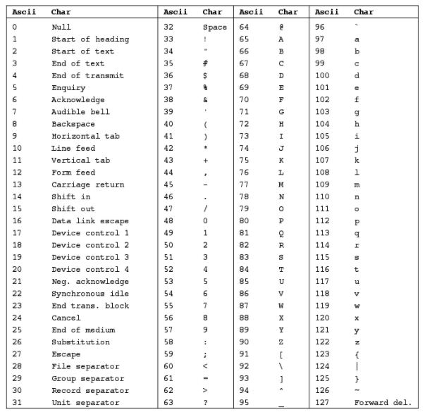
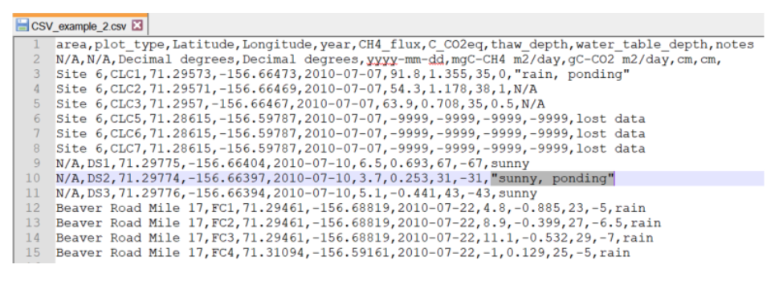
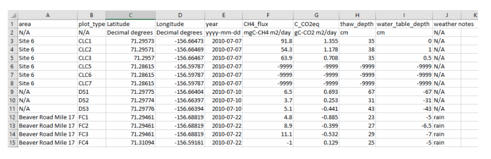
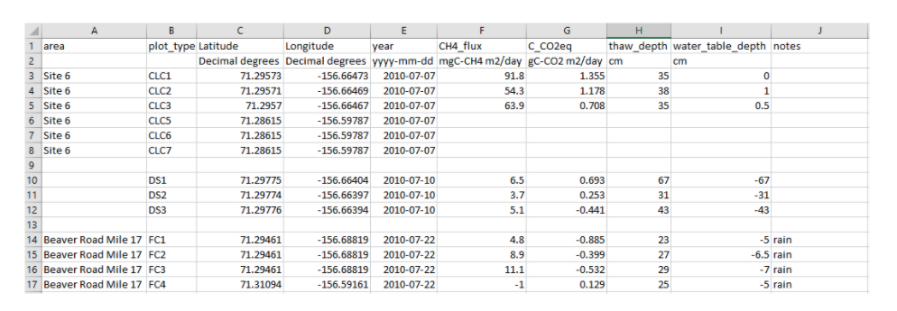
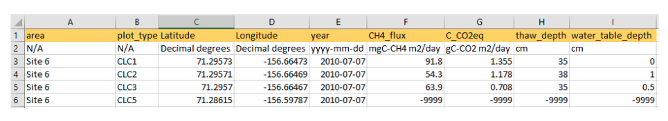
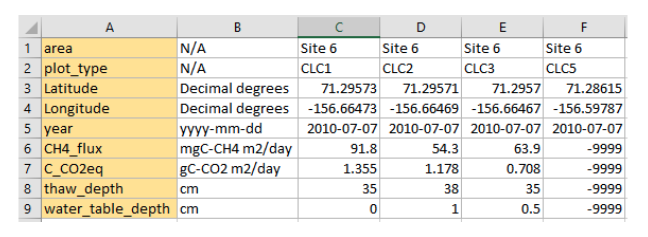
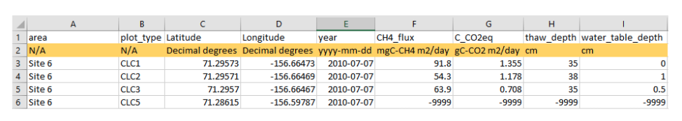
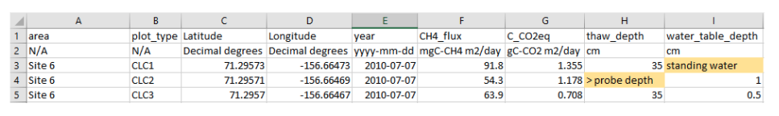
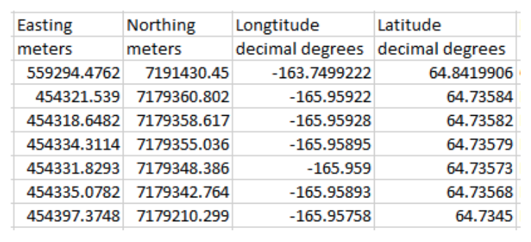

# Detailed Guide to the CSV Reporting Format Elements

## Contents of the Elements 

[File Structure](#file-structure)  
* [Character Set](#character-set)  
* [Delimiter](#delimiter)  
* [Data Matrix](#data-matrix)  
* [Field Name Row or Column](#field-name-row-or-column)  

[Naming Structure](#naming-structure)  
* [File Name](#file-name)  
* [Field Names](#field-names)  
* [Units](#units)  

[Field Structure](#field-structure)  
* [Consistent Values](#consistent-values)  
* [Missing Value Codes](#missing-value-codes)  
* [Temporal Data](#temporal-data)  
* [Temporal Data Range](#temporal-data-range)  
* [Spatial Data](#spatial-data)  

---

## File Structure

#### **Character Set**

Use the standard US-ASCII character set without extensions (no characters beyond the 127 characters) (Table 1) or use UTF-8 (which includes the ASCII character set).  

The US-ASCII characters include all upper- and lowercase characters, digits, and common punctuation used in the English language. Most English-language dataset submissions will require only characters included in the standard ASCII character set; however, UTF-8 is useful since it can support non-English characters.  

Data in a computer is represented and stored as bytes (numeric values). A character encoding scheme (e.g. ASCII, UTF-8) is used to map and translate bytes from computers into human-readable characters. Using either of these character encodings  will increase machine readability and interoperability.  

  
Table 1. The ASCII Character Set. Control characters.  

--- 

#### **Delimiter**

Save tabular data in comma separated values (CSV) format. The delimiter between columns is the comma character ",".   

For commas not meant to be a delimiter (e.g. used within a cell), use a vertical bar "|" instead of a comma or protect the comma with matching double quotation marks around the entire value.  

This requirement is necessary for machine readability as unprotected commas will disrupt the interpretation of columns and rows.

Examples:
- Use a vertical bar "|" instead of a comma  
&nbsp;&nbsp;&nbsp;&nbsp;Doe|Jane  
&nbsp;&nbsp;&nbsp;&nbsp;Standing water|ponded
&nbsp;&nbsp;&nbsp;&nbsp;Area A|Area B|Area C
- Use enclosing quotes around the cell entries containing commas   
&nbsp;&nbsp;&nbsp;&nbsp;"Doe, Jane"  
&nbsp;&nbsp;&nbsp;&nbsp;"Standing water, ponded"  
&nbsp;&nbsp;&nbsp;&nbsp;“Area A, Area B, Area C”

If data providers enter their data into programs like Microsoft Excel or Libre Office commas that appear in cells will be detected and protected by quotation marks automatically. Data that are output from models or written in a simple text editor might need quotation marks added to text cells manually.

Example of cell entries separated by commas and protection quotes around “sunny, ponding” as viewed in Notepad++

--- 

#### **Data Matrix** 

The contents of the data portion of the file must be organized in a logical and readable matrix format. There can be no empty rows and there must be the same number of columns across all of its rows.  

  

Well formatted  

  

Not well formatted  

  

--- 

#### **Field Name Row or Column**

The Data Matrix portion of each file should contain a Field Name Row or Column following the description under Field Names. The Field Names will identify the type of information found in that row or column.

The orientation of the Field Name Row or Column in the Data Matrix could be presented:  
&nbsp;&nbsp;&nbsp;&nbsp;1. Horizontally with Field Names at the top of columns or   
&nbsp;&nbsp;&nbsp;&nbsp;2. Vertically with Field Names starting rows.  

Describe the orientation of the Field Name Row or Column within the data matrix of the data file in the File-level metadata.

Example of a Field Name presented horizontally (highlighted) visualized in Excel.

  

Example of a Field Name presented vertically (highlighted) visualized in Excel.

  

--- 

## Naming Structure

#### **File Name**

Provide unique file names that are as descriptive as possible about the file contents. Use only letters (e.g. CamelCase), numbers, hyphens, and underscores "_". Do not include spaces. Do not start with an underscore or hyphen.

Example:  
* burned_plot_veg_2016.csv  
* SoilPoreWaterHillslope2019.csv

---

#### **Field Names**

Provide unique row or column Field Names that convey basic information about the contents. Use only letters (e.g. CamelCase), numbers, hyphens, and underscores "_". Do not include spaces. Do not start with an underscore or hyphen.

Descriptions of the information found in the fields should be reported and defined in the CSV Data Dictionary (CSV_dd.csv).

Examples:  
&nbsp;&nbsp;&nbsp;&nbsp;* SampleYear  
&nbsp;&nbsp;&nbsp;&nbsp;* soil_H20  
&nbsp;&nbsp;&nbsp;&nbsp;* corr_delta13C_stdev  

--- 

#### **Units**

Provide the units of measurement for the variable in one of the following ways:  
&nbsp;&nbsp;&nbsp;&nbsp;1. Immediately below the Field Name as a next row or immediately adjacent to the Field Name as next column; and/or
&nbsp;&nbsp;&nbsp;&nbsp;2. Only in the CSV Data Dictionary (CSV_dd.csv)

Insert "N/A" when units aren't applicable.  

Additional information on units should be reported and defined in the CSV Data Dictionary (CSV_dd.csv).  

Data should be represented with units of measurement approved by the International System of Units (SI), derived units (e.g., degree Celsius). Non-SI units are accepted for use and should be defined and referenced in the CSV Data Dictionary (CSV_dd.csv).  

Example with units on a second row in the data matrix. Visualized in Excel.  

  

---

## Field structure  

#### **Consistent Values**

Text and numeric data must not be used in the same Field Name Row or Column. All data within the Field Name Row or Column must use the same units of measurement.  

Example of Inconsistent values. The highlighted cells are inconsistent within the column by mixing in text and symbols. Visualized in Excel.  

   

--- 

#### **Missing Value Codes**  

All cells in the data matrix must have a value. Cells with missing data are represented with missing value code. 

For Field Rows or Columns containing numeric data, use "-9999" as the missing value code (or modify to match significant figures given the data). For Field Rows or Columns containing character data, use "N/A" as the missing value code. Missing values must be represented by values that can never be construed as actual data and must be consistent across variables. 

Report all Missing Value Codes in the File-level Metadata whether following the reporting format guidance or using different Missing Value Codes.

Example of using missing value codes in highlighted cells. Visualized in Excel.

  

--- 

#### **Temporal Data**

This field can be date only following the ISO 8601 standard (YYYY-MM-DD) and completed to known precision (e.g. YYYY-MM, YYYY). Time is not required, but all times must be preceded by a date. 

Times must be reported in Coordinated Universal Time (UTC) (YYYY-MM-DDhh:mm:ss) (use of "Z" and "T" characters are unnecessary) or Local Standard Time reporting offset or time zone in the File-level metadata. Do not report time using Daylight Savings Time. Complete times to known precision (e.g. YYYY-MM-DDhh).

For timestamped data reported as intervals, specify the interval in the field name or in CSV Data Dictionary (CSV_dd).

Temporal data using different standards can be provided as a separate variable (i.e., in an adjacent field) but only in addition to UTC format or Local Standard Time.

In cases where the entire file consists of temporal data collected at a single date and time, the date and time must be reported in the File-level Metadata.  

---

#### **Temporal Data Range**  
Present range timestamped data as paired fields for start and stop times. 

The field name for timestamped data given as a range should specify if the measurement is the start, stop, or midpoint value, or be explained in the CSV Data Dictionary (CSV_dd).

---  

#### **Spatial Data**
All geographic coordinates must be provided in WGS84 decimal format. Latitude and longitude must be provided as separate variables (i.e., in an adjacent field). For geolocated records, each row in the data matrix must contain coordinates.

Spatial data using different standards can be provided as a separate variable (i.e., in an adjacent field) but only in addition to WGS84 decimal format.

In cases where the data file does not include geographic coordinates for each row/column in the data matrix and the entire file consists of measurements collected at a single location, the geographic coordinates must be reported in the File-level metadata either as a single point location or bounding box.

  
